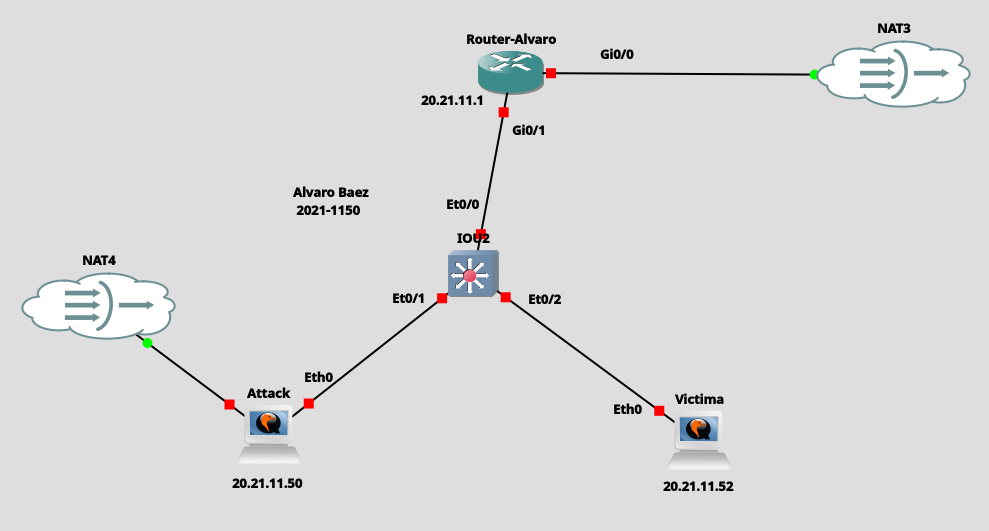
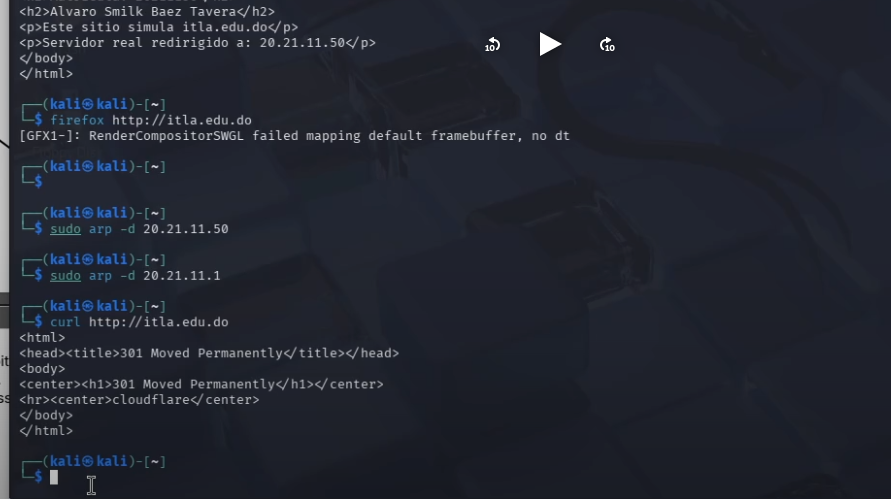
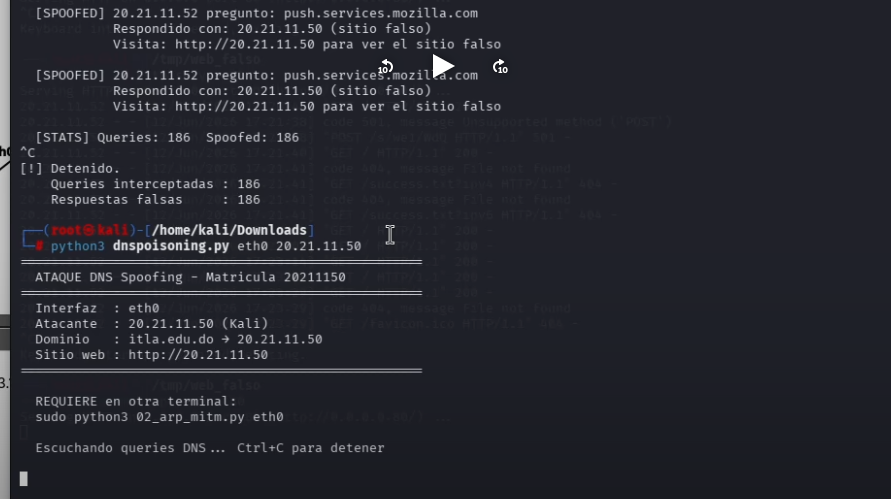
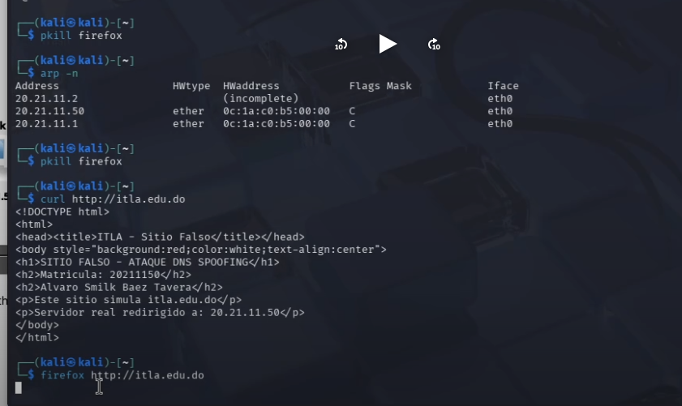

DNS Spoofing / DNS Poisoning Attack — Documentación Técnica

Autor: Alvaro Baez

Matrícula: 2021-1150

Fecha: 12 Junio 2026

Tabla de Contenidos

Objetivo del Laboratorio
Objetivo del Script / Herramienta
Requisitos
Documentación de la Red
Funcionamiento del Ataque
Demostración Paso a Paso
Contramedidas

Objetivo del Laboratorio

Demostrar cómo un atacante puede combinar ARP Spoofing con DNS Poisoning para interceptar y falsificar resoluciones DNS, redirigiendo a la víctima hacia un servidor web falso cuando intenta acceder a itla.edu.do.

Objetivo del Script / Herramienta

Herramientas utilizadas: dnsspoisoning.py + arpspoof

dnsspoisoning.py: script personalizado que intercepta consultas DNS y responde con una IP falsa antes de que llegue la respuesta legítima.
arpspoof: envenena la tabla ARP de la víctima para posicionar al atacante como Man-in-the-Middle.

Parámetros usados

DNS Poisoning Script

bashsudo python3 dnspoisoning.py eth0 20.21.11.50

ParámetroDescripcióneth0Interfaz de red del atacante20.21.11.50IP del servidor web falso (el propio atacante)

ARP Spoofing (requerido en otra terminal)

bashsudo python3 02_arp_mitm.py eth0

ParámetroDescripcióneth0Interfaz hacia la red víctima

Requisitos para utilizar la herramienta

Sistema operativo: Kali Linux
Python 3 con librería scapy
IP forwarding habilitado
Acceso a la misma red que la víctima
Servidor web corriendo en el atacante (Apache/Python HTTP)

bash# Habilitar IP forwarding
echo 1 | sudo tee /proc/sys/net/ipv4/ip_forward

# Instalar scapy
sudo apt install python3-scapy -y

Documentación de la Red

                    

Direccionamiento IP

DispositivoInterfazIPMACRol
Router-Alvaro | Gi0/1 | 20.21.11.1 | 0cf3.0eaa.0001 | Gateway / DNS
IOU2 Et0/0 | Switch 
(Kali)Eth020.21.11.50 | 0c1a.c0b5.0000 | Atacante
(Kali)Eth020.21.11.52 | 0cb2.0846.0000 | Víctima

Funcionamiento del Ataque

Estado normal:
Víctima → consulta DNS itla.edu.do → Router 20.21.11.1 → IP real

Con el ataque:
1. arpspoof envenena ARP de la víctima:
   "La MAC del gateway 20.21.11.1 soy yo (atacante)"
          ↓
2. Víctima actualiza tabla ARP con MAC del atacante
          ↓
3. Todas las consultas DNS van al atacante en vez del router
          ↓
4. dnspoisoning.py intercepta la consulta de itla.edu.do
          ↓
5. Responde con IP 20.21.11.50 (servidor web falso)
          ↓
6. Víctima accede al sitio FALSO creyendo que es itla.edu.do ✅

Demostración Paso a Paso

Antes del ataque — ARP envenenada, tabla mostrando MAC del atacante

La víctima resuelve tanto 20.21.11.50 como 20.21.11.1 con la misma MAC del atacante (0c:1a:c0:b5:00:00), confirmando que el ARP Spoofing fue exitoso y el atacante está en el medio.

arp -n en la víctima muestra que 20.21.11.1 (el gateway) tiene la misma MAC que 20.21.11.50 (el atacante). El ataque MitM está activo. Al hacer curl http://itla.edu.do se obtiene el HTML del sitio falso.

Durante el ataque — DNS Spoofing activo

bash# Terminal 1 — ARP MitM
sudo python3 02_arp_mitm.py eth0

# Terminal 2 — DNS Poisoning
sudo python3 dnspoisoning.py eth0 20.21.11.50

El script muestra [SPOOFED] para cada consulta DNS interceptada. Se observan 186 queries interceptadas y 186 respuestas falsas enviadas, todas redirigiendo a 20.21.11.50. El dominio itla.edu.do fue spoofed exitosamente.

Después — Contramedida aplicada y tráfico resuelto legítimamente

bash# Limpiar caché ARP en la víctima
sudo arp -d 20.21.11.50
sudo arp -d 20.21.11.1
sudo ip neigh flush all

Después de limpiar el ARP y aplicar las contramedidas, curl http://itla.edu.do recibe respuesta 301 Moved Permanently de Cloudflare — la IP real del sitio legítimo. El ataque fue bloqueado.

Contramedidas

Contramedida 1 — DAI en IOU2 (bloquea ARP Spoofing)

bash! En IOU2
ip dhcp snooping
ip dhcp snooping vlan 1
no ip dhcp snooping information option

ip arp inspection vlan 1

interface Et0/0
 ip dhcp snooping trust
 ip arp inspection trust

arp access-list ARP_VALIDO
 permit ip host 20.21.11.1  mac host 0cf3.0eaa.0001
 permit ip host 20.21.11.50 mac host 0c1a.c0b5.0000
 permit ip host 20.21.11.52 mac host 0cb2.0846.0000

ip arp inspection filter ARP_VALIDO vlan 1

Contramedida 2 — ACL en Router-Alvaro (bloquea DNS Poisoning)

bash! En Router-Alvaro
ip access-list extended DNS_PROTECTION
 permit udp host 20.21.11.1 any eq 53
 deny   udp any any eq 53 log
 permit ip any any

interface Gi0/1
 ip access-group DNS_PROTECTION out

Limpiar caché en la víctima

bashsudo ip neigh flush all
firefox --new-instance

¿Por qué funcionan juntas?

ContramedidaAtaque que bloqueaMecanismoDAI (IOU2)ARP SpoofingValida IP-MAC contra tabla estática; descarta ARPs falsosACL DNS (Router)DNS Poisoning directoSolo permite respuestas DNS desde el propio router

Sin DAI, la ACL sola no es suficiente — el atacante hace ARP Spoof primero y el tráfico nunca llega al router. Ambas juntas cierran el vector completamente.

Resumen de Comandos

AcciónComandoHabilitar IP forwardecho 1 > /proc/sys/net/ipv4/ip_forwardARP MitMsudo python3 02_arp_mitm.py eth0DNS Spoofsudo python3 dnspoisoning.py eth0 20.21.11.50Verificar ARP víctimaarp -nAplicar DAIip arp inspection vlan 1Aplicar ACL DNSip access-group DNS_PROTECTION outLimpiar caché víctimasudo ip neigh flush all
